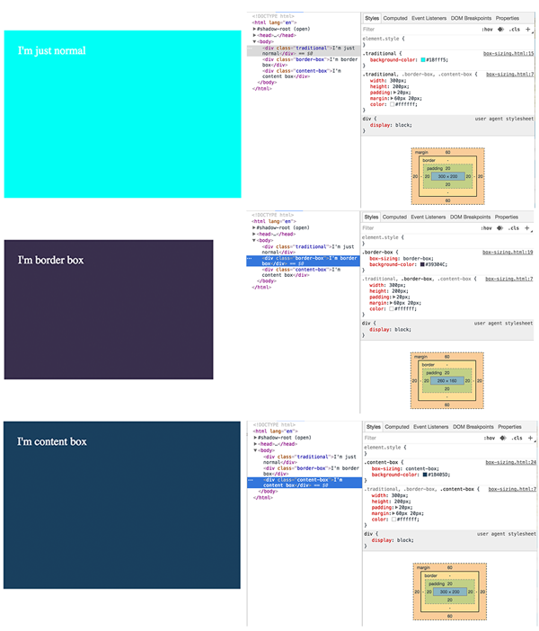

#Box-Sizing

Per [MDN](https://developer.mozilla.org/en-US/docs/Web/CSS/box-sizing), box-sizing property is used to alter the default [CSS box model](https://developer.mozilla.org/en-US/docs/Web/CSS/CSS_Box_Model/Introduction_to_the_CSS_box_model) used to calculate width and height of the elements. 

Before diving into box-sizing, let's touch briefly on box model. 

The layout of all elements in CSS is a box and its size is calculated as:

#####Width:
width + left padding + right padding + left border + right border = width of the 'box'

#####Height:
height + top padding + bottom padding + top border + bottom border = height of the 'box'

Based on the box model formula, the width you set for an element is never the final width of the actual element. 
When you set a &lt;div&gt; width of 100px and add a 10px left padding and 10px right padding, the actual width of the box or &lt;div&gt; is 120px. 

As box model evolved, we now have box-sizing, which have two options, content-box by default and border-box. 

Content-box uses the same calculation formula as the tradition box model. The border-box will take into account the padding and margin and reduce it's content size accordingly.

The example below demonstrates the differences between the content-box, border-box and the good ol box-model.

 